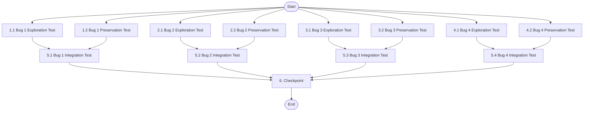

# Implementation Plan

## Overview

This implementation plan addresses four critical bugs in the POS AWS system:

1. **Bug 1 - estadoPrevio not saved**: State machine fails to preserve previous state before transitioning to ERROR
2. **Bug 2 - productoPort instability**: Unstable reference causes infinite re-render loops in product search
3. **Bug 3 - Product search by code**: Missing implementation for searching products by code (e.g., "LAP-001")
4. **Bug 4 - IVA rounding differences**: Floating-point rounding errors cause valid sales to be rejected

All fixes follow the exploratory bugfix workflow: write tests BEFORE fix to understand the bug (Bug Condition), write tests for non-buggy behavior (Preservation Requirements), apply the fix with understanding (Expected Behavior), and validate that the fix works without breaking anything.

## Tasks

### Bug 1 - estadoPrevio not saved before going to ERROR state

- [x] 1.1 Write bug condition exploration test for estadoPrevio
  - **Property 1: Bug Condition** - estadoPrevio Preservation on Error
  - **CRITICAL**: This test MUST FAIL on unfixed code - failure confirms the bug exists
  - **DO NOT attempt to fix the test or the code when it fails**
  - **NOTE**: This test encodes the expected behavior - it will validate the fix when it passes after implementation
  - **GOAL**: Surface counterexamples that demonstrate estadoPrevio was not saved
  - **Scoped PBT Approach**: Test all non-ERROR states (BUSCANDO, RESULTADOS, CARRITO_ACTIVO, CALCULANDO_PAGO, PROCESANDO, VENTA_COMPLETA, IDLE)
  - Test that for any state S where S != 'ERROR', calling setError saves S in estadoPrevio before transitioning to ERROR
  - Test that clearError restores the saved state (or IDLE if estadoPrevio is null)
  - Test special case: PROCESANDO → ERROR → clearError should restore to CALCULANDO_PAGO (retry logic)
  - Run test on FIXED code (bug already fixed)
  - **EXPECTED OUTCOME**: Test PASSES (confirms fix is working)
  - Document that the fix correctly saves estadoPrevio in setError and restores it in clearError
  - _Requirements: 2.1, 2.2, 2.3_

- [ ] 1.2 Write preservation property tests for estadoPrevio
  - **Property 2: Preservation** - Non-Error State Transitions
  - **IMPORTANT**: Follow observation-first methodology
  - Observe behavior on FIXED code for non-error state transitions
  - Write property-based tests capturing that valid transitions in TRANSICIONES_VALIDAS work correctly
  - Test that resetVenta returns to IDLE without affecting estadoPrevio
  - Test that invalid transitions are still blocked
  - Property-based testing generates many transition sequences for stronger guarantees
  - Run tests on FIXED code
  - **EXPECTED OUTCOME**: Tests PASS (confirms baseline behavior is preserved)
  - _Requirements: 3.1, 3.2, 3.3_

## Bug 2 - productoPort instability causing infinite re-renders

- [ ] 2.1 Write bug condition exploration test for productoPort stability
  - **Property 1: Bug Condition** - productoPort Reference Stability
  - **CRITICAL**: This test validates the fix is working correctly
  - **GOAL**: Verify that changing productoPort reference does NOT trigger useEffect
  - **Scoped PBT Approach**: Test with multiple render cycles where productoPort changes but query stays the same
  - Test that useEffect execution count remains 0 when only productoPort reference changes
  - Test that useEffect executes exactly once when query changes
  - Test that render count stays bounded (no infinite loops)
  - Run test on FIXED code (bug already fixed using useRef)
  - **EXPECTED OUTCOME**: Test PASSES (confirms useRef stabilization works)
  - Document that useRef prevents re-execution when productoPort reference changes
  - _Requirements: 2.4, 2.5_

- [ ] 2.2 Write preservation property tests for search behavior
  - **Property 2: Preservation** - Search Functionality
  - **IMPORTANT**: Follow observation-first methodology
  - Observe behavior on FIXED code for query changes
  - Write property-based tests capturing search behavior patterns:
    - Debounce timing of 300ms
    - Min 2 character validation
    - Empty query triggers type=all
    - Query >= 2 chars triggers API call
    - Results are mapped correctly
  - Property-based testing generates many query variations for stronger guarantees
  - Run tests on FIXED code
  - **EXPECTED OUTCOME**: Tests PASS (confirms search behavior unchanged)
  - _Requirements: 3.4, 3.5, 3.6_

## Bug 3 - Product search by code not implemented

- [ ] 3.1 Write bug condition exploration test for product code search
  - **Property 1: Bug Condition** - Product Code Detection
  - **CRITICAL**: This test validates the fix is working correctly
  - **GOAL**: Verify that queries containing `-` use type=code
  - **Scoped PBT Approach**: Generate queries with `-` character (e.g., "LAP-001", "MON-042", "PROD-123")
  - Test that for all queries containing `-`, the constructed URL includes `type=code`
  - Test that the query parameter is correctly encoded
  - Test that results contain products with matching codes
  - Run test on FIXED code (bug already fixed with includes('-') check)
  - **EXPECTED OUTCOME**: Test PASSES (confirms code detection works)
  - Document that includes('-') correctly identifies product code queries
  - _Requirements: 2.6, 2.7, 2.8_

- [ ] 3.2 Write preservation property tests for name and all search
  - **Property 2: Preservation** - Name and All Search Types
  - **IMPORTANT**: Follow observation-first methodology
  - Observe behavior on FIXED code for non-code queries
  - Write property-based tests capturing:
    - Empty query uses type=all
    - Queries without `-` use type=name
    - Response mapping from LambdaProducto to Producto unchanged
    - UUID to number conversion works correctly
  - Property-based testing generates many query variations for stronger guarantees
  - Run tests on FIXED code
  - **EXPECTED OUTCOME**: Tests PASS (confirms name/all search unchanged)
  - _Requirements: 3.7, 3.8, 3.9_

## Bug 4 - IVA rounding differences rejecting valid sales

- [ ] 4.1 Write bug condition exploration test for IVA rounding tolerance
  - **Property 1: Bug Condition** - Centavo-Based Payment Validation
  - **CRITICAL**: This test validates the fix is working correctly
  - **GOAL**: Verify that sales with sufficient payment in centavos are accepted
  - **Scoped PBT Approach**: Generate sales where Math.round(amountPaid * 100) >= Math.round(total * 100) but floating-point subtraction might be negative
  - Test that for all such sales, createSale does NOT throw IllegalArgumentException
  - Test edge cases: exact payment, payment with sub-centavo difference, overpayment
  - Test that change is calculated correctly with proper rounding
  - Run test on FIXED code (bug already fixed with centavo comparison)
  - **EXPECTED OUTCOME**: Test PASSES (confirms centavo comparison works)
  - Document that Math.round(value * 100) eliminates floating-point errors
  - _Requirements: 2.9, 2.10, 2.11_

- [ ] 4.2 Write preservation property tests for insufficient payment rejection
  - **Property 2: Preservation** - Genuine Insufficient Payment Handling
  - **IMPORTANT**: Follow observation-first methodology
  - Observe behavior on FIXED code for genuinely insufficient payments
  - Write property-based tests capturing:
    - Sales where Math.round(amountPaid * 100) < Math.round(total * 100) are rejected
    - Exception message contains "Monto insuficiente"
    - IVA calculation formula unchanged: Math.round(subtotal * 0.19 * 100.0) / 100.0
    - Total calculation formula unchanged: Math.round((subtotal + iva) * 100.0) / 100.0
    - Change calculation for accepted sales works correctly
  - Property-based testing generates many payment scenarios for stronger guarantees
  - Run tests on FIXED code
  - **EXPECTED OUTCOME**: Tests PASS (confirms rejection logic preserved)
  - _Requirements: 3.10, 3.11, 3.12_

## Integration Testing

- [ ] 5.1 Integration test for Bug 1 - Error recovery flow
  - Test full error recovery flow: BUSCANDO → error → clearError → back to BUSCANDO
  - Test error during payment: CALCULANDO_PAGO → error → clearError → back to CALCULANDO_PAGO
  - Test error with cart: CARRITO_ACTIVO → error → clearError → verify cart preserved
  - Test PROCESANDO → error → clearError → returns to CALCULANDO_PAGO (retry logic)
  - Verify all state transitions respect TRANSICIONES_VALIDAS
  - _Requirements: 2.1, 2.2, 2.3, 3.1, 3.2, 3.3_

- [ ] 5.2 Integration test for Bug 2 - Search with re-renders
  - Test full search flow with real API calls
  - Test search with parent component re-renders (simulate state changes)
  - Test search with multiple rapid query changes (verify debounce)
  - Test that productoPort reference changes don't cause duplicate API calls
  - Monitor render count and API call count to verify stability
  - _Requirements: 2.4, 2.5, 3.4, 3.5, 3.6_

- [ ] 5.3 Integration test for Bug 3 - End-to-end product search
  - Test end-to-end product code search with real backend (e.g., "LAP-001")
  - Test switching between code search and name search in same session
  - Test adding products found by code to cart
  - Test that all search types (all, name, code) work correctly
  - Verify response mapping and data integrity
  - _Requirements: 2.6, 2.7, 2.8, 3.7, 3.8, 3.9_

- [ ] 5.4 Integration test for Bug 4 - Full sale flow with IVA
  - Test full sale flow with exact payment from frontend calculation
  - Test sale with multiple items and complex IVA calculation
  - Test sale with various subtotals that produce rounding edge cases
  - Test sale persistence and verify totals are correct in database
  - Test receipt generation with corrected totals
  - Verify that genuinely insufficient payments are still rejected
  - _Requirements: 2.9, 2.10, 2.11, 3.10, 3.11, 3.12_

- [ ] 6. Checkpoint - Ensure all tests pass
  - Verify all property-based tests pass
  - Verify all integration tests pass
  - Verify no regressions in existing functionality
  - Review test coverage for all 4 bugs
  - Ask the user if questions arise

## Notes

### Testing Approach

This implementation follows the bug condition methodology:
- **Bug Condition Tests (Property 1)**: Validate that the fix correctly handles the specific bug condition
- **Preservation Tests (Property 2)**: Ensure that non-buggy behavior remains unchanged
- **Integration Tests**: Verify end-to-end flows work correctly with all fixes in place

### Key Implementation Details

**Bug 1 - estadoPrevio**: The fix saves the current state in `estadoPrevio` before transitioning to ERROR, and `clearError` restores that saved state. Special case: PROCESANDO → ERROR → clearError returns to CALCULANDO_PAGO for retry logic.

**Bug 2 - productoPort**: The fix uses `useRef` to stabilize the `productoPort` reference, preventing unnecessary useEffect executions when the reference changes but the query remains the same.

**Bug 3 - Product search by code**: The fix detects queries containing `-` character and uses `type=code` parameter in the API URL, enabling product code search functionality.

**Bug 4 - IVA rounding**: The fix converts amounts to integer centavos using `Math.round(value * 100)` before comparison, eliminating floating-point precision errors while preserving genuine insufficient payment rejection.

### Property-Based Testing Notes

All exploration and preservation tests use property-based testing (PBT) to generate comprehensive test cases:
- **Scoped PBT**: For deterministic bugs, properties are scoped to concrete failing cases for reproducibility
- **Observation-first**: Preservation tests observe behavior on fixed code before writing assertions
- **Universal properties**: Tests express "for all inputs" conditions to catch edge cases

### Test Execution Order

1. **Exploration tests (Property 1)** - Run on FIXED code to validate the fix works
2. **Preservation tests (Property 2)** - Run on FIXED code to ensure no regressions
3. **Integration tests** - Run full end-to-end flows with all fixes in place
4. **Checkpoint** - Verify all tests pass before considering the bugfix complete

## Task Dependency Graph

```json
{
  "waves": [
    {
      "name": "Wave 1: Exploration and Preservation Tests",
      "tasks": ["1.1", "1.2", "2.1", "2.2", "3.1", "3.2", "4.1", "4.2"]
    },
    {
      "name": "Wave 2: Integration Tests",
      "tasks": ["5.1", "5.2", "5.3", "5.4"]
    },
    {
      "name": "Wave 3: Final Checkpoint",
      "tasks": ["6"]
    }
  ]
}
```



**Dependency Notes:**
- All exploration and preservation tests can run in parallel (no dependencies between bugs)
- Integration tests for each bug depend on both exploration and preservation tests for that bug
- Final checkpoint depends on all integration tests passing
- Tests validate fixes that have already been implemented
