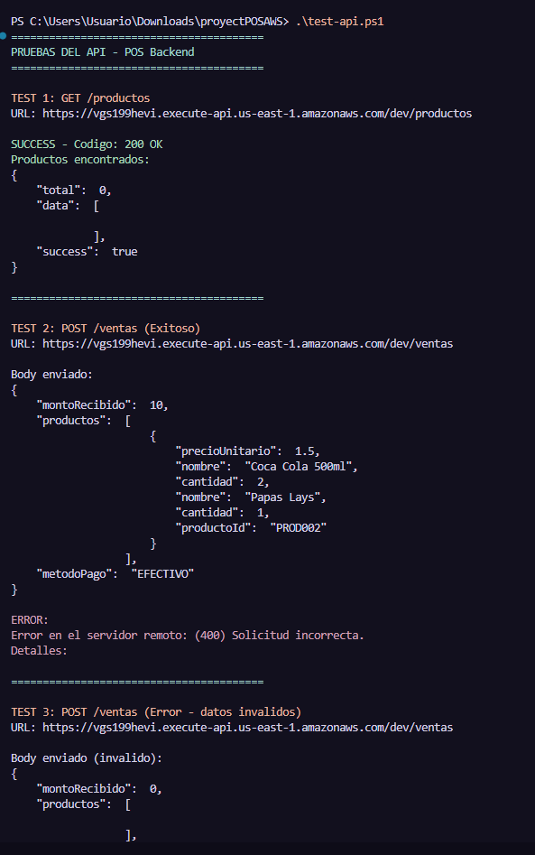
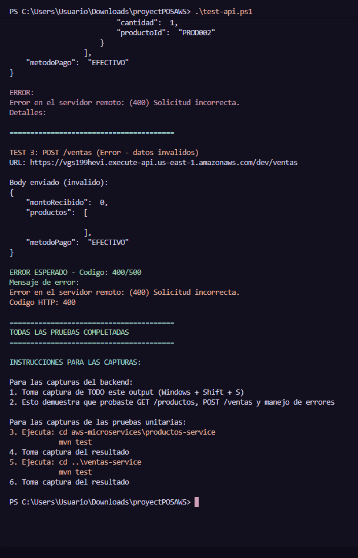
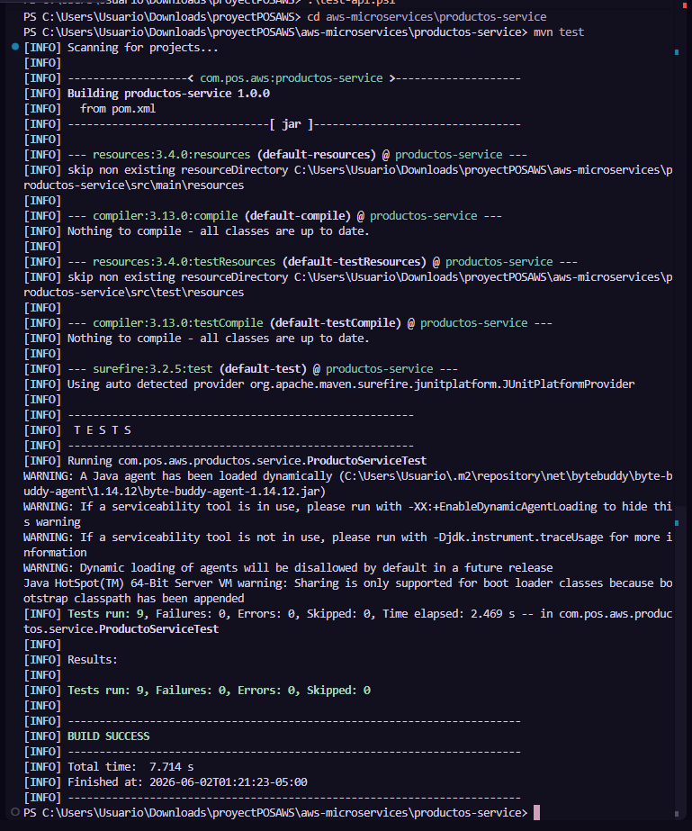
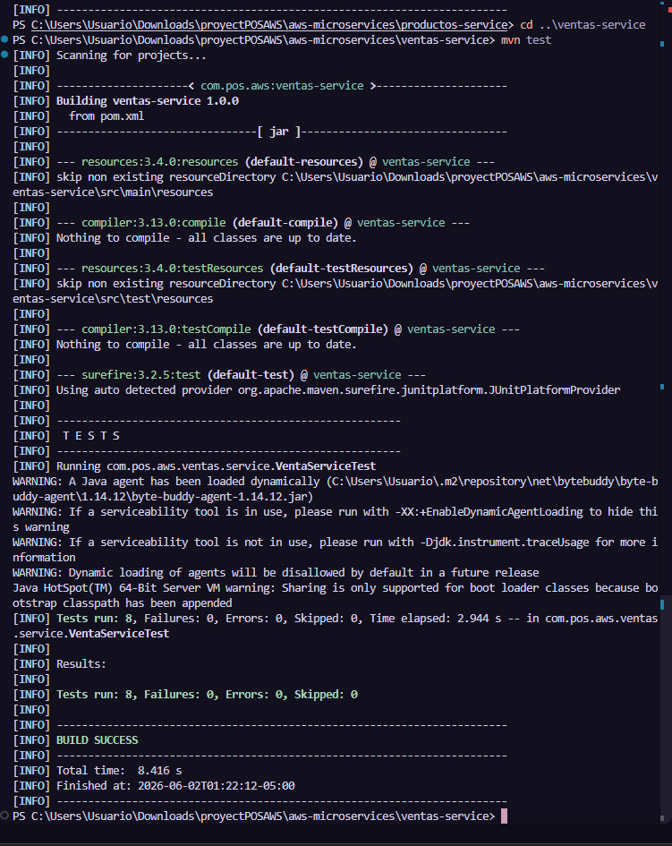
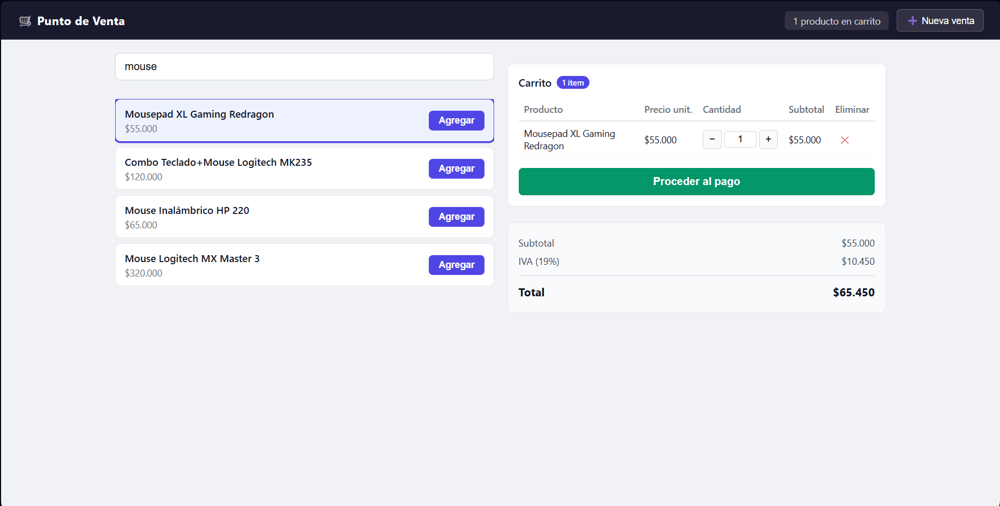
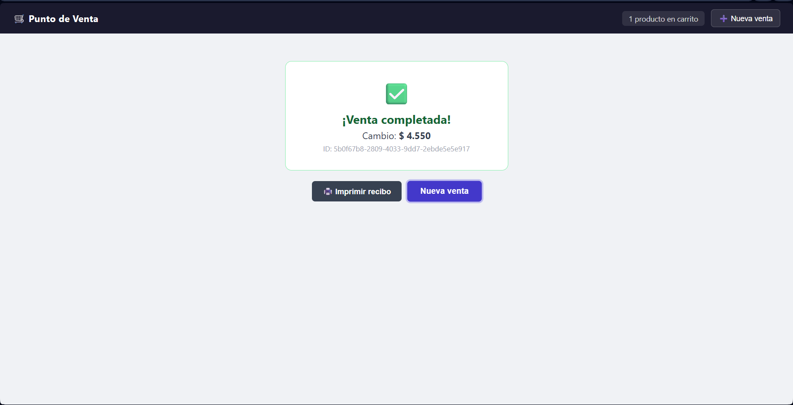
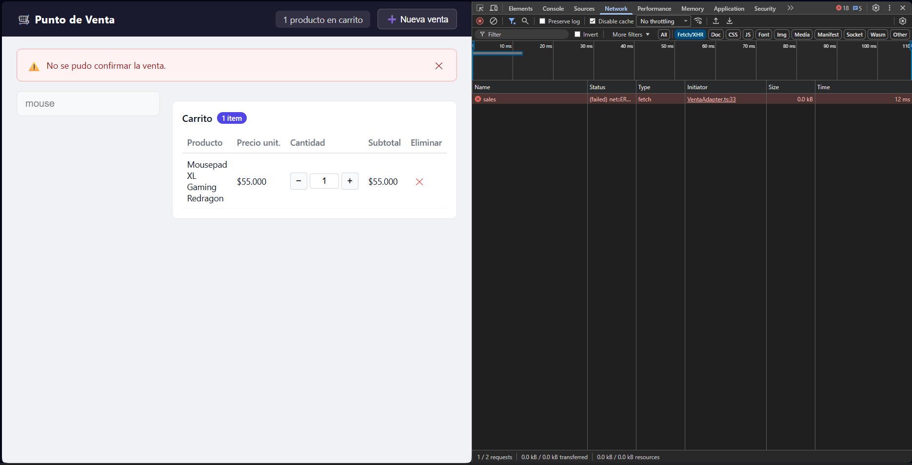

# ProyectPOS — Sistema de Punto de Venta Serverless

Sistema completo de punto de venta (POS) con arquitectura **serverless en AWS**, desarrollado con **React 18 + TypeScript** en el frontend y **Java 21 + AWS Lambda + DynamoDB + API Gateway** en el backend.

**Desarrollado siguiendo Spec-Driven Development (SDD)** — Los specs se escriben antes del código.

---

## Tabla de contenidos

- [Vista general](#vista-general)
- [Arquitectura](#arquitectura)
- [Capturas de pantalla](#capturas-de-pantalla)
- [Estructura del proyecto](#estructura-del-proyecto)
- [Quick Start](#quick-start)
- [Backend — AWS SAM](#backend--aws-sam)
- [Frontend — React](#frontend--react)
- [Testing](#testing)
- [Proceso SDD](#proceso-sdd)
- [URL del API Gateway Desplegado](#url-del-api-gateway-desplegado)
- [Stack tecnológico](#stack-tecnológico)

---

## Vista general

ProyectPOS es un sistema de punto de venta diseñado para cajeros. Permite gestionar el ciclo completo de ventas: búsqueda de productos, construcción de carrito, procesamiento de pagos en efectivo, confirmación de ventas y registro en DynamoDB.

### Características principales

- ✅ Búsqueda de productos por nombre, código o ID
- ✅ Gestión de carrito de compras con actualización en tiempo real
- ✅ Procesamiento de pagos en efectivo con cálculo automático de cambio
- ✅ Cálculo automático de IVA (19%)
- ✅ Registro de ventas en DynamoDB con ID único
- ✅ Arquitectura serverless escalable y sin mantenimiento de servidores
- ✅ Frontend React con arquitectura hexagonal
- ✅ Backend Java con AWS Lambda y API Gateway

---

## Arquitectura

El sistema sigue una arquitectura **cliente-servidor serverless** con AWS:

```
┌──────────────────────┐
│   React Frontend     │
│   (TypeScript)       │
│                      │
│  - SearchBar         │
│  - ProductList       │
│  - ShoppingCart      │
│  - PaymentPanel      │
│  - SaleConfirmation  │
└──────────┬───────────┘
           │ HTTPS
           │
           ▼
┌──────────────────────────────────────────────┐
│         AWS API Gateway                      │
│  https://vgs199hevi.execute-api...           │
│                                              │
│  GET  /dev/productos                         │
│  POST /dev/ventas                            │
└──────────┬───────────────────────────────────┘
           │
           │ Invoke
           │
    ┌──────┴──────┐
    ▼             ▼
┌─────────┐   ┌─────────┐
│ Lambda  │   │ Lambda  │
│Productos│   │ Ventas  │
│(Java 21)│   │(Java 21)│
└────┬────┘   └────┬────┘
     │             │
     │ SDK         │ SDK
     ▼             ▼
┌──────────┐   ┌──────────┐
│Productos │   │  Ventas  │
│  Table   │   │  Table   │
│(DynamoDB)│   │(DynamoDB)│
└──────────┘   └──────────┘
```

### Componentes principales

1. **Frontend (React 18 + TypeScript)**
   - Arquitectura hexagonal con ports y adapters
   - Estado global con Zustand
   - Comunicación HTTP con API Gateway
   - Interfaz responsive y moderna

2. **API Gateway**
   - Punto de entrada único para todas las peticiones
   - Enrutamiento a funciones Lambda
   - CORS habilitado para frontend
   - Gestión automática de SSL/TLS

3. **AWS Lambda (Java 21)**
   - Funciones serverless sin servidores que administrar
   - Escalado automático según demanda
   - Pago por uso (solo cuando se ejecutan)
   - Handler → Service → Repository (capas limpias)

4. **DynamoDB**
   - Base de datos NoSQL serverless
   - Escalado automático
   - Alta disponibilidad
   - Tablas: Productos-dev y Ventas-dev

---

## Capturas de pantalla

### Backend — Pruebas del API

**Pruebas del API Gateway (GET /productos, POST /ventas, manejo de errores)**





**Pruebas unitarias — Productos Service**



**Pruebas unitarias — Ventas Service**



### Frontend — Aplicación en funcionamiento

**Listado de productos**



**Venta exitosa**



**Manejo de errores**



---

## Estructura del proyecto

```
proyectPOSAWS/
│
├── PROYECTPOS/                    ← Carpeta principal del proyecto
│   │
│   ├── pos-backend/               ← Backend SAM serverless
│   │   ├── .kiro/specs/pos-backend/  ← Especificaciones SDD del backend
│   │   │   ├── requirements.md    ← 14 endpoints documentados
│   │   │   ├── design.md          ← ADRs, DynamoDB schema, Lambda design
│   │   │   └── tasks.md           ← 40+ tareas de implementación
│   │   │
│   │   ├── productos-service/     ← Lambda GET /productos
│   │   │   ├── pom.xml
│   │   │   └── src/
│   │   │       ├── main/java/com/pos/aws/productos/
│   │   │       │   ├── handler/   ← ProductosHandler (entrada HTTP)
│   │   │       │   ├── service/   ← ProductoService (lógica de negocio)
│   │   │       │   ├── repository/← ProductoRepository (acceso a DynamoDB)
│   │   │       │   └── model/     ← DTOs y entidades
│   │   │       └── test/          ← ProductoServiceTest (tests con mocks)
│   │   │
│   │   ├── ventas-service/        ← Lambda POST /ventas
│   │   │   ├── pom.xml
│   │   │   └── src/
│   │   │       ├── main/java/com/pos/aws/ventas/
│   │   │       │   ├── handler/   ← VentasHandler (entrada HTTP)
│   │   │       │   ├── service/   ← VentaService (lógica + cálculo IVA 19%)
│   │   │       │   ├── repository/← VentaRepository (acceso a DynamoDB)
│   │   │       │   └── model/     ← DTOs y entidades
│   │   │       └── test/          ← VentaServiceTest (tests con mocks)
│   │   │
│   │   ├── template.yaml          ← Define API Gateway + Lambdas + DynamoDB
│   │   ├── samconfig.toml         ← Configuración de despliegue AWS SAM
│   │   └── README.md              ← Documentación completa del backend
│   │
│   └── pos-frontend/              ← Aplicación React
│       ├── .kiro/specs/pos-frontend/  ← Especificaciones SDD del frontend
│       │   ├── requirements.md    ← 19 requisitos funcionales
│       │   ├── design.md          ← State machine, arquitectura hexagonal
│       │   └── tasks.md           ← 18 fases de implementación
│       │
│       ├── src/
│       │   ├── domain/            ← Tipos TypeScript, puertos, calculadora
│       │   ├── application/       ← Store Zustand + hooks personalizados
│       │   ├── infrastructure/    ← Adaptadores HTTP para API Gateway
│       │   └── ui/                ← Componentes React
│       │
│       ├── package.json
│       ├── vite.config.ts
│       └── README.md              ← Documentación completa del frontend
│
├── screenshots/                   ← Capturas de pantalla para documentación
│   ├── 1-backend-api-tests1.png
│   ├── 1-backend-api-tests2.png
│   ├── 2-productos-unit-tests.png
│   ├── 3-ventas-unit-tests.png
│   ├── 4-frontend-productos-list.png
│   ├── 5-frontend-venta-exitosa.png
│   └── 6-frontend-manejo-error.png
│
├── test-api.ps1                   ← Script PowerShell para probar el API
├── ANALISIS-CUMPLIMIENTO-EXAMEN.md  ← Verificación de requisitos del examen
└── README.md                      ← Este archivo
```

---

## Quick Start

### Prerrequisitos

- **Backend:** AWS CLI configurado, AWS SAM CLI, Java 21, Maven
- **Frontend:** Node.js 18+, npm

### 1. Desplegar el Backend en AWS

```bash
cd PROYECTPOS/pos-backend

# Compilar las funciones Lambda
sam build

# Desplegar a AWS (primera vez con --guided)
sam deploy --guided

# En despliegues posteriores:
sam deploy
```

Al finalizar, SAM mostrará la URL del API Gateway:

```
Outputs
-----------------------------------------------------------------
Key: ApiGatewayUrl
Value: https://vgs199hevi.execute-api.us-east-1.amazonaws.com/dev
-----------------------------------------------------------------
```

**Guarda esta URL** para configurar el frontend.

### 2. Configurar y ejecutar el Frontend

```bash
cd PROYECTPOS/pos-frontend

# Instalar dependencias
npm install

# Crear archivo de configuración
cp .env.example .env

# Editar .env y pegar la URL del API Gateway
# VITE_API_BASE_URL=https://vgs199hevi.execute-api.us-east-1.amazonaws.com/dev

# Iniciar servidor de desarrollo
npm run dev
```

Abre tu navegador en `http://localhost:5173`

### 3. Probar el API manualmente (opcional)

Usa el script PowerShell incluido:

```powershell
.\test-api.ps1
```

Este script ejecuta automáticamente:
- GET /productos (listar todos)
- POST /ventas (venta exitosa)
- POST /ventas (error con datos inválidos)

---

## Backend — AWS SAM

### Endpoints disponibles

**Base URL:** `https://vgs199hevi.execute-api.us-east-1.amazonaws.com/dev`

| Método | Endpoint | Descripción | Parámetros |
|--------|----------|-------------|------------|
| `GET` | `/productos` | Listar todos los productos | Query: `tipo=todos` |
| `GET` | `/productos` | Buscar por nombre | Query: `tipo=nombre&q={query}` |
| `GET` | `/productos` | Buscar por ID | Query: `tipo=id&q={uuid}` |
| `POST` | `/ventas` | Registrar una venta | Body JSON (ver abajo) |

### Ejemplo: Registrar una venta

**Request:**

```bash
POST /dev/ventas
Content-Type: application/json

{
  "productos": [
    {
      "productoId": "PROD001",
      "nombre": "Coca Cola 500ml",
      "cantidad": 2,
      "precioUnitario": 1.50
    },
    {
      "productoId": "PROD002",
      "nombre": "Papas Lays",
      "cantidad": 1,
      "precioUnitario": 2.00
    }
  ],
  "metodoPago": "EFECTIVO",
  "montoRecibido": 10.00
}
```

**Response (201 Created):**

```json
{
  "ventaId": "uuid-generado",
  "subtotal": 5.00,
  "iva": 0.95,
  "total": 5.95,
  "cambio": 4.05,
  "metodoPago": "EFECTIVO",
  "estado": "COMPLETADA",
  "timestamp": "2026-06-02T01:15:00Z"
}
```

### Tablas DynamoDB

**Productos-dev**

| Campo | Tipo | Descripción |
|-------|------|-------------|
| `id` | String (PK) | ID único del producto |
| `nombre` | String | Nombre del producto |
| `codigo` | String | Código interno |
| `precio` | Number | Precio unitario |
| `stock` | Number | Cantidad disponible |
| `activo` | Boolean | Estado del producto |

**Ventas-dev**

| Campo | Tipo | Descripción |
|-------|------|-------------|
| `ventaId` | String (PK) | ID único de la venta (UUID) |
| `productos` | List | Array de items vendidos |
| `metodoPago` | String | EFECTIVO o TARJETA |
| `subtotal` | Number | Subtotal sin IVA |
| `iva` | Number | IVA 19% |
| `total` | Number | Total con IVA |
| `cambio` | Number | Cambio devuelto |
| `estado` | String | COMPLETADA |
| `timestamp` | String | Fecha/hora ISO 8601 |

### Comandos útiles

```bash
# Compilar solo un servicio
cd PROYECTPOS/pos-backend/productos-service
mvn clean package -DskipTests

# Ejecutar tests
mvn test

# Ver logs de Lambda en tiempo real
sam logs -n LambdaProductos --stack-name pos-serverless-dev --tail

# Eliminar el stack de AWS
sam delete --stack-name pos-serverless-dev
```

---

## Frontend — React

El frontend implementa **arquitectura hexagonal** para desacoplar la lógica de negocio de la infraestructura.

### Arquitectura hexagonal

```
┌─────────────────────────────────────────────────┐
│                   UI Layer                      │
│  (SearchBar, ProductList, Cart, PaymentPanel)   │
└────────────────────┬────────────────────────────┘
                     │
                     ▼
┌─────────────────────────────────────────────────┐
│              Application Layer                  │
│         (Zustand Store + Custom Hooks)          │
└────────────────────┬────────────────────────────┘
                     │
                     ▼
┌─────────────────────────────────────────────────┐
│                Domain Layer                     │
│       (Ports/Interfaces + Business Logic)       │
│  - IProductoPort                                │
│  - IVentaPort                                   │
│  - Calculadora (subtotal, IVA, total, cambio)   │
└────────────────────┬────────────────────────────┘
                     │
                     ▼
┌─────────────────────────────────────────────────┐
│            Infrastructure Layer                 │
│          (HTTP Adapters para API Gateway)       │
│  - ProductoAdapter → API Gateway /productos     │
│  - VentaAdapter → API Gateway /ventas           │
└─────────────────────────────────────────────────┘
```

### Configuración

Crea un archivo `.env` en `PROYECTPOS/pos-frontend/`:

```bash
# URL del API Gateway (sin / al final)
VITE_API_BASE_URL=https://vgs199hevi.execute-api.us-east-1.amazonaws.com/dev
```

### Comandos

```bash
cd PROYECTPOS/pos-frontend

# Instalar dependencias
npm install

# Desarrollo
npm run dev

# Build para producción
npm run build

# Preview del build
npm run preview

# Tests
npm run test

# Linter
npm run lint
```

---

## Testing

### Backend — Pruebas unitarias con Mockito

Todos los tests aíslan DynamoDB usando **mocks de Mockito**:

```java
@ExtendWith(MockitoExtension.class)
public class ProductoServiceTest {

    @Mock
    private ProductoRepository repository;

    @InjectMocks
    private ProductoService service;

    @Test
    void buscarTodos_retornaListaDeProductos() {
        // Arrange
        when(repository.buscarTodos()).thenReturn(List.of(
            new Producto("1", "Mouse", 45000),
            new Producto("2", "Teclado", 120000)
        ));

        // Act
        List<ProductoResponse> resultado = service.buscarTodos();

        // Assert
        assertEquals(2, resultado.size());
        verify(repository).buscarTodos();
    }

    @Test
    void buscarPorId_productoNoExiste_lanzaExcepcion() {
        // Arrange
        when(repository.buscarPorId("999")).thenReturn(Optional.empty());

        // Act & Assert
        assertThrows(ProductoNoEncontradoException.class, 
            () -> service.buscarPorId("999"));
    }
}
```

**Casos de prueba cubiertos:**

- ✅ Respuesta exitosa con datos válidos
- ✅ Tabla vacía (retorna lista vacía sin errores)
- ✅ Error de conexión a DynamoDB
- ✅ Validaciones de entrada (IDs inválidos, campos vacíos)
- ✅ Cálculos correctos (IVA, total, cambio)

### Ejecutar tests

```bash
# Backend - Productos
cd aws-microservices/productos-service
mvn test

# Backend - Ventas
cd aws-microservices/ventas-service
mvn test

# Ver reporte de cobertura
mvn jacoco:report
# Abrir: target/site/jacoco/index.html
```

### Frontend — Tests con Vitest

```bash
cd PROYECTPOS/frontend/pos-frontend
npm run test
```

---

## Proceso SDD

Este proyecto sigue **Spec-Driven Development (SDD)**: **los specs se escriben antes del código**.

### ¿Qué es SDD?

SDD es una metodología donde la especificación (requirements, design, tasks) se escribe **antes** de implementar cualquier línea de código. Esto garantiza:

- ✅ Claridad en los requisitos antes de empezar
- ✅ Trazabilidad: cada línea de código tiene un "por qué"
- ✅ Testabilidad: los acceptance criteria se convierten en casos de prueba
- ✅ Documentación viva y actualizada
- ✅ Menos bugs porque el diseño se valida antes de codificar

### Estructura de los Specs

Todos los specs están en `.kiro/specs/`:

```
.kiro/specs/
├── pos-backend/
│   ├── requirements.md  ← QUÉ: 14 endpoints, acceptance criteria, error codes
│   ├── design.md        ← CÓMO: tablas DynamoDB, ADRs, request/response schemas
│   └── tasks.md         ← ORDEN: 40+ tareas secuenciales de implementación
│
└── pos-frontend/
    ├── requirements.md  ← QUÉ: 19 requisitos funcionales, user stories
    ├── design.md        ← CÓMO: state machine, arquitectura hexagonal, componentes
    └── tasks.md         ← ORDEN: 18 fases de implementación
```

### Flujo de trabajo SDD

1. **Especificación (Requirements)**
   - Se escriben user stories y acceptance criteria
   - Se definen casos de error y validaciones
   - Se revisan y aprueban antes de diseñar

2. **Diseño (Design)**
   - Se diseña la arquitectura y estructura de datos
   - Se documentan decisiones de diseño (ADRs)
   - Se definen contratos de API y modelos de datos

3. **Planificación (Tasks)**
   - Se descompone el trabajo en tareas secuenciales
   - Cada tarea es trazable a un requisito
   - Se establece el orden de implementación

4. **Implementación**
   - Se codifica siguiendo los specs
   - Cada commit referencia el task ID
   - Acceptance criteria → casos de prueba

5. **Validación**
   - Tests verifican los acceptance criteria
   - Se actualizan los specs si se descubren gaps

### Evidencia SDD en este proyecto

✅ **Timestamps:** Los commits de specs son anteriores a los de código  
✅ **Trazabilidad:** Cada archivo tiene un Task ID asociado  
✅ **Acceptance Criteria → Tests:** Los casos de prueba verifican los AC  
✅ **Documentación viva:** Los specs se actualizan durante el desarrollo  

### Beneficios observados

- 🎯 **Claridad:** Todo el equipo sabe qué construir
- 📝 **Documentación:** Los specs sirven como documentación técnica
- 🧪 **Calidad:** Menos bugs porque el diseño se valida antes
- 🔄 **Trazabilidad:** Cada decisión está documentada
- 🤝 **Colaboración:** Los specs facilitan code reviews

---

## URL del API Gateway Desplegado

### Producción (Entorno dev)

```
https://vgs199hevi.execute-api.us-east-1.amazonaws.com/dev
```

### Endpoints completos

```bash
# Listar todos los productos
GET https://vgs199hevi.execute-api.us-east-1.amazonaws.com/dev/productos

# Buscar producto por nombre
GET https://vgs199hevi.execute-api.us-east-1.amazonaws.com/dev/productos?tipo=nombre&q=coca

# Registrar venta
POST https://vgs199hevi.execute-api.us-east-1.amazonaws.com/dev/ventas
Content-Type: application/json
```

### Probar desde terminal

```bash
# GET productos
curl "https://vgs199hevi.execute-api.us-east-1.amazonaws.com/dev/productos"

# POST venta
curl -X POST "https://vgs199hevi.execute-api.us-east-1.amazonaws.com/dev/ventas" \
  -H "Content-Type: application/json" \
  -d '{
    "productos": [
      {
        "productoId": "PROD001",
        "nombre": "Test Product",
        "cantidad": 1,
        "precioUnitario": 10.00
      }
    ],
    "metodoPago": "EFECTIVO",
    "montoRecibido": 15.00
  }'
```

---

## Stack tecnológico

### Backend

| Tecnología | Versión | Propósito |
|------------|---------|-----------|
| **Java** | 21 LTS | Lenguaje de programación |
| **AWS Lambda** | — | Funciones serverless |
| **AWS API Gateway** | REST API | Exposición de endpoints HTTP |
| **AWS DynamoDB** | — | Base de datos NoSQL serverless |
| **AWS SAM** | 1.x | Infraestructura como código (IaC) |
| **Maven** | 3.9+ | Gestión de dependencias y build |
| **Jackson** | 2.17 | Serialización/deserialización JSON |
| **JUnit 5** | 5.10 | Framework de testing |
| **Mockito** | 5.11 | Mocks para tests unitarios |

### Frontend

| Tecnología | Versión | Propósito |
|------------|---------|-----------|
| **React** | 18.x | Biblioteca de UI |
| **TypeScript** | 5.x | Tipado estático |
| **Vite** | 5.x | Build tool y dev server |
| **Zustand** | 4.x | Estado global (alternativa ligera a Redux) |
| **Vitest** | 1.x | Framework de testing |
| **ESLint** | 8.x | Linting de código |

### Infraestructura

| Servicio | Propósito |
|----------|-----------|
| **AWS Lambda** | Ejecución de funciones sin servidor |
| **AWS API Gateway** | Gestión de endpoints REST con HTTPS |
| **AWS DynamoDB** | Base de datos NoSQL con escalado automático |
| **AWS CloudFormation** | Despliegue de infraestructura (vía SAM) |
| **AWS IAM** | Permisos y roles para Lambdas |

---

## Framework elegido y justificación

### Backend: Java 21 + AWS Lambda

**Por qué Java 21:**
- ✅ LTS (Long Term Support) con soporte hasta 2031
- ✅ Rendimiento mejorado con GraalVM y records
- ✅ Ecosistema maduro con Maven y librerías probadas
- ✅ Tipado estático previene errores en tiempo de compilación
- ✅ Jackson para JSON de alto rendimiento

**Por qué AWS Lambda:**
- ✅ Serverless: sin servidores que administrar
- ✅ Escalado automático según demanda
- ✅ Pago por uso (solo se cobra cuando se ejecuta)
- ✅ Alta disponibilidad integrada
- ✅ Integración nativa con API Gateway y DynamoDB

### Frontend: React 18 + TypeScript

**Por qué React 18:**
- ✅ Biblioteca más popular para UI (gran comunidad)
- ✅ Hooks modernos (useState, useEffect, custom hooks)
- ✅ Virtual DOM para renderizado eficiente
- ✅ Ecosistema maduro con tooling excelente
- ✅ Component-based architecture

**Por qué TypeScript:**
- ✅ Tipado estático previene errores en tiempo de desarrollo
- ✅ Autocompletado y refactoring seguros en el IDE
- ✅ Interfaces para definir contratos claros
- ✅ Mejor documentación implícita en el código
- ✅ Facilita el trabajo en equipo

**Por qué Vite:**
- ✅ Dev server ultra-rápido con HMR instantáneo
- ✅ Build optimizado con Rollup
- ✅ Soporte nativo de TypeScript
- ✅ Configuración mínima
- ✅ Más rápido que Create React App

---

## Documentación adicional

### Análisis de cumplimiento

Ver [`ANALISIS-CUMPLIMIENTO-EXAMEN.md`](./ANALISIS-CUMPLIMIENTO-EXAMEN.md) para verificación detallada de los requisitos del examen.

### Specs completos

- **Backend:** [`.kiro/specs/pos-backend/`](./.kiro/specs/pos-backend/)
- **Frontend:** [`.kiro/specs/pos-frontend/`](./.kiro/specs/pos-frontend/)

### READMEs específicos

- **Backend:** [`PROYECTPOS/pos-backend/README.md`](./PROYECTPOS/pos-backend/README.md)
- **Frontend:** [`PROYECTPOS/pos-frontend/README.md`](./PROYECTPOS/pos-frontend/README.md)

---

## Autor

**Bairon Ardila**  
GitHub: [@BaironArd](https://github.com/BaironArd)  
Proyecto: [ProyectPOSAWS](https://github.com/BaironArd/ProyectPOSAWS)

---

## Licencia

MIT — Proyecto académico para demostración de arquitectura serverless con AWS.

---

## Contacto y soporte

Si tienes preguntas o encuentras problemas:

1. Revisa la [documentación de troubleshooting](./PROYECTPOS/pos-backend/README.md#troubleshooting)
2. Verifica los [logs de CloudWatch](https://console.aws.amazon.com/cloudwatch/)
3. Abre un issue en GitHub

---

**¡Gracias por revisar este proyecto!** 🚀
